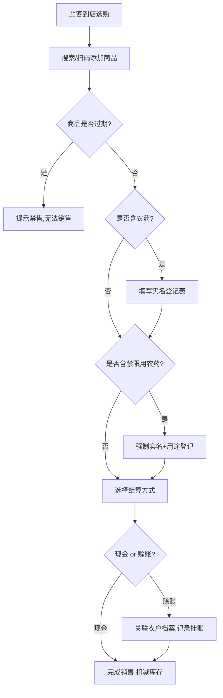
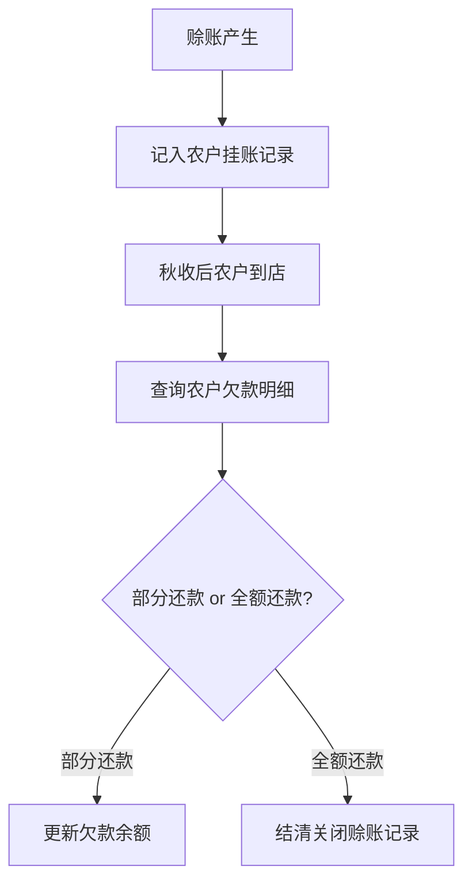

## 1. 产品概述

农资店管理系统是一套面向基层农资零售店的全流程数字化管理平台，涵盖种子、化肥、农药三大品类库存管理，销售出库与农户赊账结算，以及禁限用农药实名登记与过期农资自动禁售等合规管控功能。
- 解决农资店手工记账效率低、赊账难追踪、农药销售合规风险等问题
- 目标用户为乡镇农资零售店经营者，助力其实现进销存一体化与监管合规

## 2. 核心功能

### 2.1 用户角色

| 角色 | 注册方式 | 核心权限 |
|------|----------|----------|
| 店主/管理员 | 系统初始化创建 | 全部功能：库存管理、销售出库、赊账管理、实名登记、系统设置 |
| 店员 | 管理员创建账号 | 销售出库、库存查询、实名登记（无删除和结账权限） |

### 2.2 功能模块

1. **仪表盘首页**：今日销售概览、库存预警（过期/不足）、赊账待收汇总、快捷操作入口
2. **种子库存管理**：品种/规格/产地/保质期/批号录入、查询、编辑、库存盘点
3. **化肥农药库存管理**：品牌/含量/剂型/登记证号/有效期录入、查询、编辑、分类筛选
4. **销售出库管理**：扫码/搜索商品、购物车、结算（现金/赊账）、农药实名登记
5. **农户赊账管理**：农户档案、挂账记录、秋收后结账、欠款统计
6. **禁限用农药实名登记**：身份证登记、用途记录、合规校验、销售台账
7. **过期农资自动禁售**：保质期监控、自动标记禁售、临期预警

### 2.3 页面详情

| 页面名称 | 模块名称 | 功能描述 |
|----------|----------|----------|
| 仪表盘 | 销售概览卡片 | 今日销售额/订单数/利润，近7日趋势图 |
| 仪表盘 | 库存预警区 | 过期商品红色标记列表、库存不足商品列表、临期商品列表 |
| 仪表盘 | 赊账待收区 | 待收款总额、逾期未还款农户列表、快捷催收入口 |
| 仪表盘 | 快捷操作栏 | 新建销售、入库登记、赊账结账、农药实名登记快捷按钮 |
| 种子库存 | 种子列表 | 按品种/产地/批号搜索筛选，表格展示所有字段，支持排序 |
| 种子库存 | 种子录入/编辑 | 表单：品种名、规格(包装大小)、产地、保质期、批号、库存数量、进价、售价 |
| 种子库存 | 库存盘点 | 实际数量 vs 系统数量对比，差异标记 |
| 化肥农药库存 | 商品列表 | 按品牌/类型(化肥/农药)/剂型筛选，表格展示所有字段 |
| 化肥农药库存 | 商品录入/编辑 | 表单：商品名、品牌、类型(化肥/农药)、含量、剂型、登记证号、有效期、库存数量、进价、售价、是否禁限用 |
| 化肥农药库存 | 过期标记区 | 自动标记已过期商品禁售，临期商品黄色预警 |
| 销售出库 | 销售界面 | 搜索商品→加入购物车→选择结算方式→完成出库 |
| 销售出库 | 农药实名登记表 | 购买人姓名、身份证号、联系电话、购买用途、购买数量 |
| 销售出库 | 销售记录 | 历史销售单据列表，支持按日期/农户/商品筛选 |
| 农户赊账 | 农户档案 | 农户姓名、电话、地址、累计欠款、信用评级 |
| 农户赊账 | 挂账记录 | 每笔赊账的商品明细、金额、日期、预计还款期(默认秋收) |
| 农户赊账 | 结账操作 | 选择农户→显示欠款明细→部分/全额还款→打印收据 |
| 农户赊账 | 欠款统计 | 各农户欠款排行、月度赊账/回款趋势图 |
| 实名登记台 | 登记表单 | 身份证号自动校验、购买用途下拉(病虫害防治/除草/施肥等)、关联销售单 |
| 实名登记台 | 登记台账 | 按日期/身份证/农药名称查询历史登记记录 |
| 系统设置 | 商品分类管理 | 种子/化肥/农药分类及子分类维护 |
| 系统设置 | 禁限用农药名录 | 国家禁限用农药名单管理，标记后销售时强制实名登记 |
| 系统设置 | 过期规则配置 | 临期预警天数(默认30天)、自动禁售开关 |

## 3. 核心流程

### 3.1 销售出库流程
顾客到店选购商品 → 店员搜索/扫码添加商品到购物车 → 系统校验商品状态（过期则拦截）→ 若含农药则触发实名登记 → 填写购买人身份证和用途 → 选择结算方式（现金/赊账）→ 若赊账则关联农户档案 → 生成销售单据 → 扣减库存

### 3.2 农户赊账流程
赊账产生（销售时选择赊账）→ 自动记入农户挂账记录 → 秋收后农户到店结账 → 店员查询农户欠款 → 选择部分/全额还款 → 更新赊账状态 → 结清则关闭

### 3.3 过期禁售流程
系统每日自动扫描库存保质期/有效期 → 已过期商品自动标记为"禁售"状态 → 临期商品标记"预警"状态 → 销售时校验，禁售商品无法加入购物车 → 预警商品弹窗提醒

## 4. 用户界面设计

### 4.1 设计风格
- 主色调：深绿色(#1B5E20)象征农业生机，辅以金色(#F9A825)点缀代表丰收
- 按钮风格：圆角矩形(8px)，主操作绿色实心，危险操作红色，次操作描边
- 字体：标题用思源黑体/Noto Sans SC，正文用系统默认，数据数字用等宽字体
- 布局风格：左侧固定导航栏 + 右侧内容区，卡片式模块布局
- 图标风格：线性图标，2px描边，绿色主题色

### 4.2 页面设计概览

| 页面名称 | 模块名称 | UI元素 |
|----------|----------|--------|
| 仪表盘 | 销售概览卡片 | 3个统计卡片(金额/订单/利润) + 折线趋势图，绿色渐变背景 |
| 仪表盘 | 库存预警区 | 红色边框过期卡片 + 黄色边框临期卡片，列表形式，点击跳转 |
| 仪表盘 | 赊账待收区 | 圆环图显示待收总额，下方逾期农户列表红色高亮 |
| 种子库存 | 种子列表 | 表格+顶部搜索栏+筛选下拉，状态列用色标(正常绿/临期黄/过期红) |
| 种子库存 | 种子录入 | 弹窗表单，必填项标红星，底部取消/确认按钮 |
| 化肥农药库存 | 商品列表 | 同种子列表，增加"登记证号"和"是否禁限用"列 |
| 化肥农药库存 | 过期标记 | 禁售行灰色背景+红色"禁售"标签，临期行黄色"预警"标签 |
| 销售出库 | 销售界面 | 左侧商品搜索区 + 右侧购物车，底部结算栏固定 |
| 销售出库 | 农药实名登记 | 模态弹窗，身份证输入框带格式校验提示，用途下拉选择 |
| 农户赊账 | 农户档案 | 卡片式列表，每张卡片含头像/姓名/电话/欠款金额 |
| 农户赊账 | 结账操作 | 侧边抽屉式，欠款明细表 + 还款金额输入 + 确认结账 |
| 实名登记台 | 登记台账 | 时间线式列表，每条含时间/身份证(脱敏)/农药名/用途 |

### 4.3 响应式设计
- 桌面端优先设计，最小宽度1280px
- 平板端：导航栏收缩为图标模式，表格列适当隐藏
- 移动端暂不适配，作为后续迭代

### 4.4 3D场景
- 不适用
