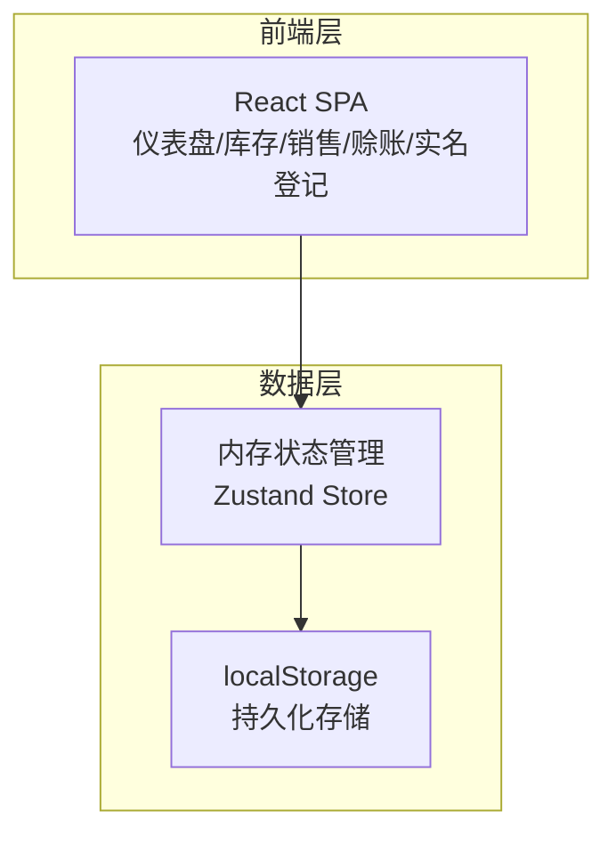
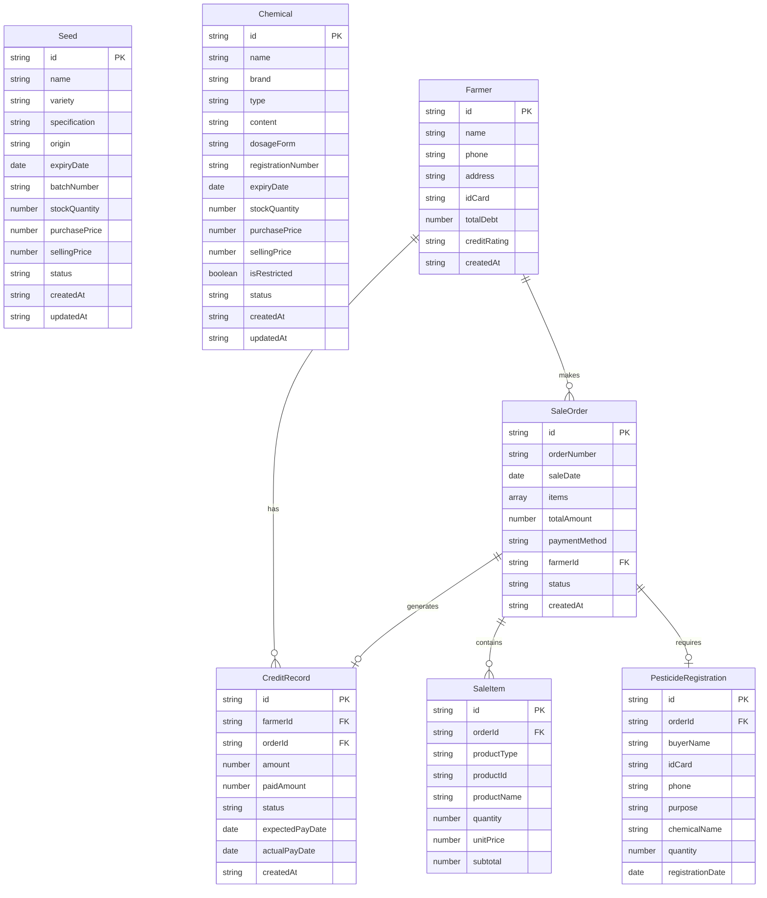

## 1. 架构设计



纯前端单页应用，使用 localStorage 作为持久化存储，Zustand 管理应用状态，无需后端服务。

## 2. 技术说明

- 前端：React@18 + TypeScript + Tailwind CSS@3 + Vite
- 初始化工具：Vite (react-ts模板)
- 状态管理：Zustand（轻量级，支持持久化中间件）
- 后端：无（纯前端应用，数据存储于 localStorage）
- 数据库：无（localStorage + Zustand persist middleware）
- 图表：Recharts
- 日期处理：date-fns
- 图标：Lucide React

## 3. 路由定义

| 路由 | 用途 |
|------|------|
| / | 仪表盘首页 - 销售概览、库存预警、赊账待收 |
| /seeds | 种子库存管理 - 列表、新增、编辑、盘点 |
| /chemicals | 化肥农药库存管理 - 列表、新增、编辑、过期标记 |
| /sales | 销售出库 - 销售界面、购物车、结算 |
| /sales/history | 销售记录 - 历史销售单据查询 |
| /credit | 农户赊账管理 - 农户档案、挂账记录、结账 |
| /registration | 实名登记台 - 农药实名登记、登记台账 |
| /settings | 系统设置 - 分类管理、禁限用名录、过期规则 |

## 4. API定义

无后端API，使用 Zustand Store 直接操作数据。核心数据操作通过 Store 中定义的 actions 完成。

## 5. 服务端架构

不适用（纯前端应用）

## 6. 数据模型

### 6.1 数据模型定义



### 6.2 数据定义语言

使用 TypeScript 接口定义数据结构，Zustand persist middleware 持久化到 localStorage：

```typescript
interface Seed {
  id: string;
  name: string;
  variety: string;
  specification: string;
  origin: string;
  expiryDate: string;
  batchNumber: string;
  stockQuantity: number;
  purchasePrice: number;
  sellingPrice: number;
  status: 'normal' | 'warning' | 'expired';
  createdAt: string;
  updatedAt: string;
}

interface Chemical {
  id: string;
  name: string;
  brand: string;
  type: 'fertilizer' | 'pesticide';
  content: string;
  dosageForm: string;
  registrationNumber: string;
  expiryDate: string;
  stockQuantity: number;
  purchasePrice: number;
  sellingPrice: number;
  isRestricted: boolean;
  status: 'normal' | 'warning' | 'expired';
  createdAt: string;
  updatedAt: string;
}

interface Farmer {
  id: string;
  name: string;
  phone: string;
  address: string;
  idCard: string;
  totalDebt: number;
  creditRating: 'A' | 'B' | 'C';
  createdAt: string;
}

interface SaleOrder {
  id: string;
  orderNumber: string;
  saleDate: string;
  items: SaleItem[];
  totalAmount: number;
  paymentMethod: 'cash' | 'credit';
  farmerId?: string;
  status: 'completed' | 'credited';
  createdAt: string;
}

interface SaleItem {
  id: string;
  productType: 'seed' | 'chemical';
  productId: string;
  productName: string;
  quantity: number;
  unitPrice: number;
  subtotal: number;
}

interface CreditRecord {
  id: string;
  farmerId: string;
  orderId: string;
  amount: number;
  paidAmount: number;
  status: 'unpaid' | 'partial' | 'paid';
  expectedPayDate: string;
  actualPayDate?: string;
  createdAt: string;
}

interface PesticideRegistration {
  id: string;
  orderId: string;
  buyerName: string;
  idCard: string;
  phone: string;
  purpose: string;
  chemicalName: string;
  quantity: number;
  registrationDate: string;
}
```
